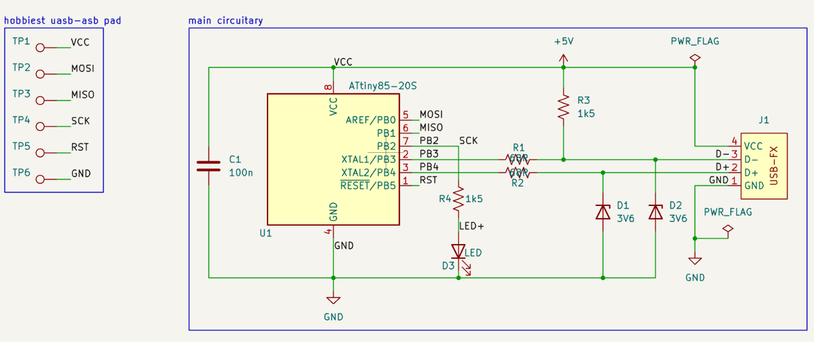
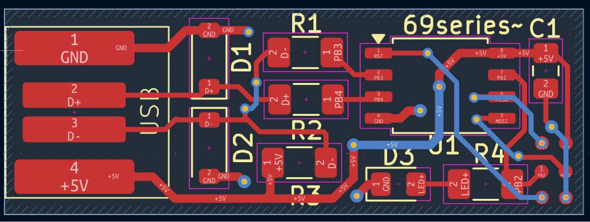
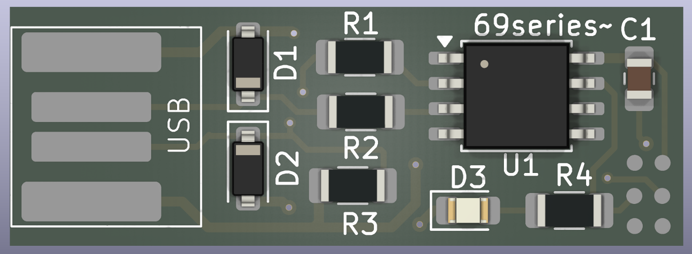
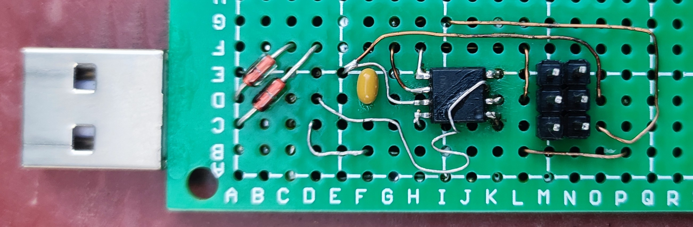
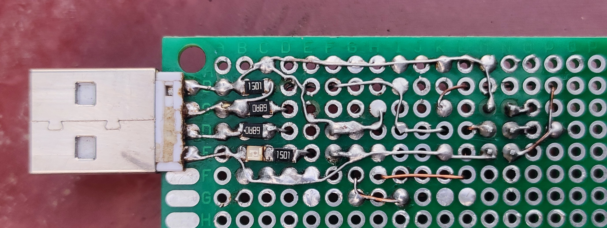

# ATtiny85 USB HID Keyboard

A fully custom USB HID keyboard dongle built on ATtiny85 — bare metal C firmware,
custom PCB designed in KiCad 10, no Arduino, no HAL, no bootloader abstractions.
Plug it into any USB port and it enumerates as a real HID keyboard device.

---

# ATtiny85 USB HID Keyboard


A fully custom USB HID keyboard dongle...

## What it does

Plugs directly into a USB-A port and acts as an autonomous HID keyboard.
Planned automation payloads (see `firmware/` for examples):

- One-click temp folder cleaner (`Win+R → %temp% → Ctrl+A → Shift+Del`)
- Stored credential injector (password manager dongle)
- Custom keyboard macro sequences
- Any HID keystroke automation — limited only by firmware logic

---

## Hardware

| Part | Value | Package |
|------|-------|---------|
| U1 | ATtiny85-20SU | SOIC-8 |
| R1, R2 | 68Ω | 1206 |
| R3 | 1.5kΩ (pull-up) | 1206 |
| R4 | 1.5kΩ (LED) | 1206 |
| C1 | 100nF | 0805 |
| D1, D2 | 3.6V Zener | SOD-123 |
| D3 | LED | 0402 |
| J1 | USB-FX | Custom PCB-edge footprint |

**PCB:** 31.31 × 11.8 × 0.8mm — slides directly into USB-A female socket.
Custom USB-FX footprint — PCB edge pads act as USB-A plug contacts.
Designed in KiCad 10. Ground pour on F.Cu.

**Schematic:** `docs/schematic.png`
**PCB Layout:** `docs/pcb.png`
**3D Render:** `docs/3dpcb_front.png` / `docs/3dpcb_back.png`
**Gerbers + BOM:** `hardware/fabrication/`

---

### Schematic


### PCB Layout


### 3D Render



## Firmware

Pure bare-metal C. No Arduino core, no HAL, no bootloader.
Uses the V-USB library (obdev, v20121206) for software USB bit-banging on PB3/PB4.

**Toolchain:** avr-gcc (WinAVR), avrdude, VS Code

### Build and flash

```bash
cd firmware
make
make fuses
make flash
```

Or use the included automation script:

```bash
69s.bat -unlock -17A
```

### Fuse bits

```bash
avrdude -c usbasp -p attiny85 -U lfuse:w:0xE1:m -U hfuse:w:0xDD:m
```

- `lfuse 0xE1` — internal 16.5MHz PLL oscillator (required for V-USB timing)
- `hfuse 0xDD` — RESET enabled, SPI programming on

### Pin mapping

| ATtiny85 Pin | Function |
|--------------|----------|
| PB3 (pin 2) | USB D− |
| PB4 (pin 3) | USB D+ |
| PB2 (pin 7) | Status LED |
| PB0 (pin 5) | ICSP MOSI / TP2 |
| PB1 (pin 6) | ICSP MISO / TP3 |
| PB2 (pin 7) | ICSP SCK / TP4 |
| PB5 (pin 1) | RESET / TP5 |

---

## Project Structure

```
attiny85-usb-hid/
├── docs/                     # Schematic, PCB renders, design notes
│   ├── schematic.png
│   ├── pcb.png
│   ├── 3dpcb_front.png
│   ├── 3dpcb_back.png
│   └── design-notes.md
├── firmware/                 # Bare metal C firmware
│   ├── main.c                # Main application
│   ├── usbconfig.h           # V-USB hardware configuration
│   ├── Makefile
│   ├── 69s.bat               # One-shot build+flash automation
│   └── usbdrv/               # V-USB library (obdev v20121206)
├── hardware/
│   ├── fabrication/          # Gerbers, BOM, positions for JLCPCB
│   │   ├── t85-gerber.zip
│   │   ├── bom.csv
│   │   └── positions.csv
│   ├── hardware_prototype/   # Prototype build photos, all versions
│   │   ├── spider_config.jpeg        # Initial 6-wire ICSP test setup
│   │   ├── vers_1_front.jpeg         # Version 1 prototype
│   │   ├── vers_1_back.jpeg
│   │   ├── final_cleanup_version_front.jpg  # Final build (PB4 hot-wired)
│   │   └── final_cleanup_version_back.jpg
│   ├── t85-usb.kicad_sch
│   ├── t85-usb.kicad_pcb
│   └── t85-usb.pdf
└── README.md
```
---

## Key Design Decisions

**Why ATtiny85?** 8-pin SOIC, 8KB flash, runs at 16.5MHz via internal PLL —
no external crystal needed, freeing PB3/PB4 for USB D+/D−.

**Why bare metal C?** Full control over every cycle. No Arduino abstraction layer,
no bootloader overhead. USB enumeration, HID descriptors, OSCCAL calibration —
all implemented and understood at the register level.

**Why V-USB?** ATtiny85 has no hardware USB peripheral. V-USB bit-bangs USB
low-speed (1.5 Mbit/s) in software using hand-tuned AVR assembly timed to
the exact cycle. This is the same approach used by Digispark.

**USB signal conditioning:** ATtiny85 GPIO swings 0–5V but USB data lines
must not exceed 3.3V. D1/D2 (3.6V zeners) clamp the high state.
R1/R2 (68Ω) provide impedance matching for the transmission line.

**OSCCAL runtime calibration:** Internal RC oscillator has ±10% factory
tolerance. V-USB requires ±1% at 16.5MHz. `calibrateOscillator()` uses
`usbMeasureFrameLength()` on every power-up to tune OSCCAL to the exact
live USB SOF timing, ensuring reliable enumeration regardless of temperature
or chip-to-chip variance.

**VID/PID:** Uses V-USB's shared free VID/PID pool (0x16C0 / 0x27DB).
Appropriate for open-source/personal projects per obdev's usage terms.

**Double enumeration init:** Two disconnect/reconnect cycles on startup —
the first lets the host settle/timeout on an initial connection attempt,
the second is the real enumeration. This mirrors the bootloader-exit →
user-program-start transition pattern and significantly improves
host compatibility, particularly on modern xHCI controllers.

**Windows driver binding:** Chose PID 0x27DB (matching Digispark's HID
keyboard PID) to ensure Windows binds the device to `hidusb.sys` (the
native HID class driver) rather than `libusb0.sys`. This is critical —
a generic libusb driver does not poll the interrupt-IN endpoint at the OS
level, so keystrokes never reach the active application regardless of
how correctly the USB descriptors enumerate.

---

## Host Compatibility

Tested and working:

| Host | Result |
|------|--------|
| Windows 11 (ASUS TUF F15, xHCI) | ✅ Full enumeration, keystrokes delivered |
| Android (Redmi Note 10 Pro, OTG) | ✅ Working |
| Android (Redmi 6, OTG) | ⚠️ Enumeration succeeds, keystrokes inconsistent |

---

## Prototype Notes

Built and tested on perfboard before PCB fabrication.
`hardware/prototype/spider_config.jpeg` shows the initial 6-wire ICSP
test harness soldered directly to the chip legs before any perfboard work.
`final_cleanup_version_*` shows the final prototype — PB4 (USB D+) pin
was damaged during rework and required a fine wire hot-fix, which held
reliably through all testing.

---

### Prototype Photos



---
## Debugging Journey

This project involved deep debugging across hardware, firmware, toolchain,
and host-compatibility layers. Notable findings:

- **OSCCAL drift** caused intermittent enumeration — solved with runtime
  calibration using `usbMeasureFrameLength()`
- **Windows driver binding** (libusb0 vs hidusb) was the root cause of
  keystrokes never arriving despite correct USB enumeration — identified
  by comparing working Digispark sketch logs against our own via UsbTreeView
- **xHCI interrupt-IN scheduling** behaves differently from legacy UHCI/OHCI
  for low-speed software-USB devices — characterized and worked around via
  double enumeration cycle and correct PID selection

Full debugging notes in `docs/design-notes.md`.

---

## Future Work

- [ ] Example firmware payloads (temp cleaner, credential injector, macro runner)
- [ ] PCB fabrication and SMD assembly at JLCPCB
- [ ] ICSP test pad verification on real PCB
- [ ] v2.0 PCB with ICSP pads on back copper for in-circuit reprogramming

---

## Author

**Narendra Sagolsem** — Electronics Engineer
Portfolio: [s69series-3-0.vercel.app](https://s69series-3-0.vercel.app)
GitHub: [69series](https://github.com/69series)

---

## License

Firmware: MIT
V-USB library: GPL v2 — see `firmware/usbdrv/License.txt`
Hardware: CERN-OHL-S v2