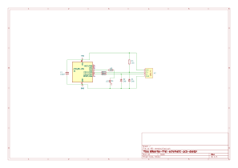
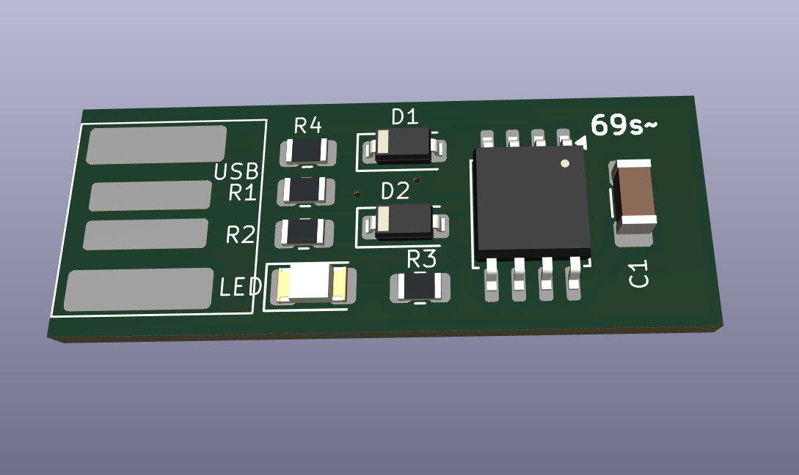

# ATtiny85 USB HID Device

A minimal USB HID device built on ATtiny85 using V-USB software USB library.
Designed from scratch — custom PCB, bare metal C firmware, no Arduino or HAL abstractions.

## What it does
Plugs into any USB port and acts as a HID keyboard device.
Use cases:
- Password manager dongle
- One-click automation (clear temp, run scripts)
- Custom keyboard shortcuts

## Hardware
- **MCU:** ATtiny85-20SU (SOIC-8)
- **USB:** V-USB software USB on PB3/PB4
- **PCB:** 31.31×11.8×0.8mm — plugs directly into USB-A port
- **Designed in:** KiCad 10

## Schematic


## PCB Layout


## Project Structure
attiny85-usb-hid/
├── hardware/          # KiCad schematic, PCB, gerbers
├── firmware/          # Bare metal C code (V-USB)
├── docs/              # Design notes and decisions
└── README.md

## Building Firmware
Coming soon — bare metal C with V-USB library.
Toolchain: avr-gcc, avrdude, VS Code.

## Programming the Chip
```bash
# Set fuse bits
avrdude -c usbasp -p attiny85 -U lfuse:w:0xE1:m -U hfuse:w:0xDD:m

# Flash firmware
avrdude -c usbasp -p attiny85 -U flash:w:main.hex
```

## Status
- [x] Schematic design
- [x] PCB layout
- [x] Gerbers exported
- [ ] Firmware — bare metal HID keyboard
- [ ] Testing on hardware

## Author
Narendra Sagolsem — Electronics Engineer